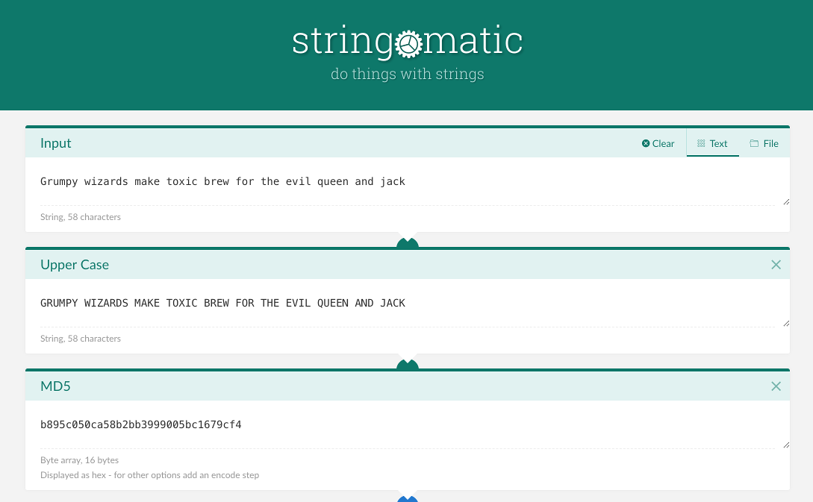

# string-o-matic

There are many great sites for developers that provide hashing, encryption, and string manipulation functions.
Unfortunately most of them don't do the work in the browser with javascript, don't offer a live preview, have
each function on a different page, and don't give a choice of output formats for byte array output.

The aim of this site is to provide all those options in one place. You'll be able to build up a pipeline of
transformation steps that take your input and then process it any way you want to give the desired output.
Want an encrypted value represented as a URL-safe base 64 string with line separators every 80 characters?
No problem. Want your hex string in upper case with commas between each pair? Easy.

This site will also be easy to run locally for developers who want to test encryption and hashing without
entering passwords and secret keys on a website. As there are no server round trips and no analytics or other
libraries included from other sites, this site should be safe for use with sensitive data.

### Current status

This project was started in March 2018 and hasn't reached MVP yet. Once it has a basic feature set, pull requests
adding new transformation steps will be very welcome.

### Why name it string-o-matic?

It's whimsical, but it describes the idea of building a machine that transforms a string in a series of steps. Good
.com domains are hard to find so this is what I ended up with.

### Dependency notes

**bcryptjs** has a reference to Node's Crypto module which won't resolve in a browser but causes webpack to include node
polyfills or mocks totalling hundreds of kilobytes. The ideal solution is to fork bcryptjs and remove this reference.
Another option is ejecting the project to modify webpack config. As a temporary measure, the minified script is in the
public directory and the unit tests add it to the window object from node_modules.